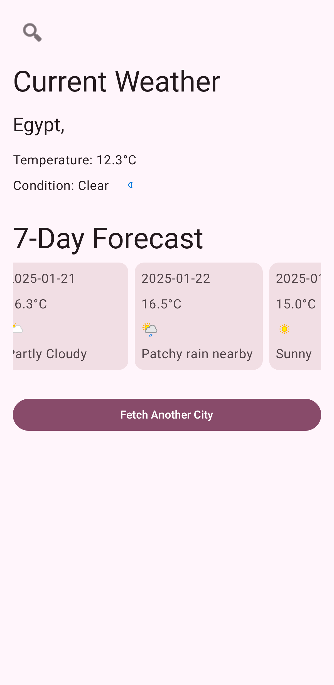
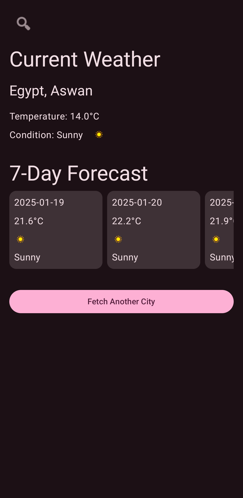

# WeatherApp

WeatherApp is a modern Android application built with **Jetpack Compose**, **MVVM architecture**, and **Clean Architecture principles**. It provides
real-time weather information for any city, including current weather conditions and a 7-day forecast. The app is designed to be scalable,
maintainable, and user-friendly.

---

## Features

- **Current Weather**: Displays the current temperature, weather condition, and other relevant details.
- **7-Day Forecast**: Shows the weather forecast for the next 7 days.
- **Offline Support**: Caches weather data locally using Room, allowing users to access previously fetched data without an internet connection.
- **Error Handling**: Gracefully handles network errors and displays appropriate messages to the user.
- **Responsive UI**: Built with Jetpack Compose for a modern and responsive user interface.
- **Back Button Handling**: The back button behaves as the "Fetch Another City" button in the `WeatherScreen` and exits the app in the
  `CityInputScreen`.

---

## Technologies Used

### 1. **Jetpack Compose**

- **Why?**: Jetpack Compose is the modern toolkit for building native Android UIs. It simplifies UI development with declarative syntax, making the
  code more readable and maintainable.
- **What it does**: Used to build all the UI components in the app, including the `CityInputScreen` and `WeatherScreen`.

### 2. **MVVM Architecture**

- **Why?**: MVVM (Model-View-ViewModel) separates the UI logic from the business logic, making the app easier to test and maintain.
- **What it does**: The `ViewModel` handles data fetching and state management, while the UI (Composables) observes the state and updates accordingly.

### 3. **Clean Architecture**

- **Why?**: Clean Architecture ensures separation of concerns and makes the app more scalable and testable.
- **What it does**: The app is divided into three layers:
    - **Presentation Layer**: Contains UI components and ViewModels.
    - **Domain Layer**: Contains use cases and business logic.
    - **Data Layer**: Handles data fetching from the network and local database.

### 4. **Hilt (Dependency Injection)**

- **Why?**: Hilt simplifies dependency injection in Android apps, reducing boilerplate code and making the app more modular.
- **What it does**: Used to inject dependencies like `WeatherRepository`, `ViewModel`, and `Room Database` into the app.

### 5. **Retrofit**

- **Why?**: Retrofit is a type-safe HTTP client for Android, making it easy to consume RESTful APIs.
- **What it does**: Used to fetch weather data from the [WeatherAPI](https://www.weatherapi.com/).

### 6. **Room Database**

- **Why?**: Room provides an abstraction layer over SQLite, making it easier to work with local databases.
- **What it does**: Used to cache weather data locally for offline access.

### 7. **Coroutines**

- **Why?**: Coroutines simplify asynchronous programming in Kotlin, making the code more readable and avoiding callback hell.
- **What it does**: Used for network requests and database operations.

### 8. **Coil**

- **Why?**: Coil is a modern image loading library for Android, optimized for performance and ease of use.
- **What it does**: Used to load weather icons and other images.

### 9. **State Management**

- **Why?**: Jetpack Compose's `State` and `MutableState` make it easy to manage UI state in a reactive way.
- **What it does**: Used to manage the state of the UI (e.g., loading, success, error).

## Screenshots
<table>
  <tr>
    <td></td>
    <td></td>
  </tr>
  <tr>
    <td></td>
    <td></td>
  </tr>
</table>